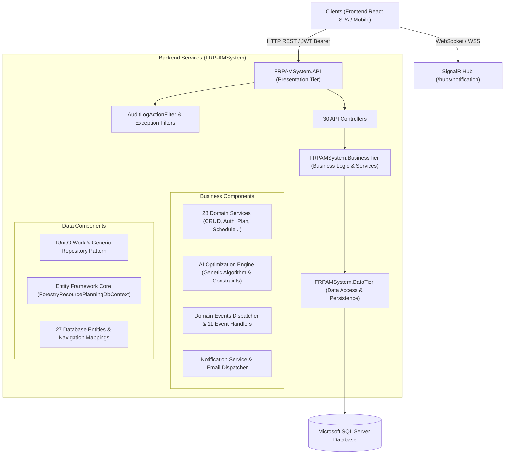
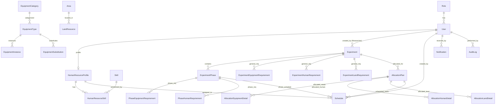
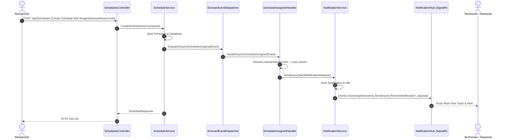
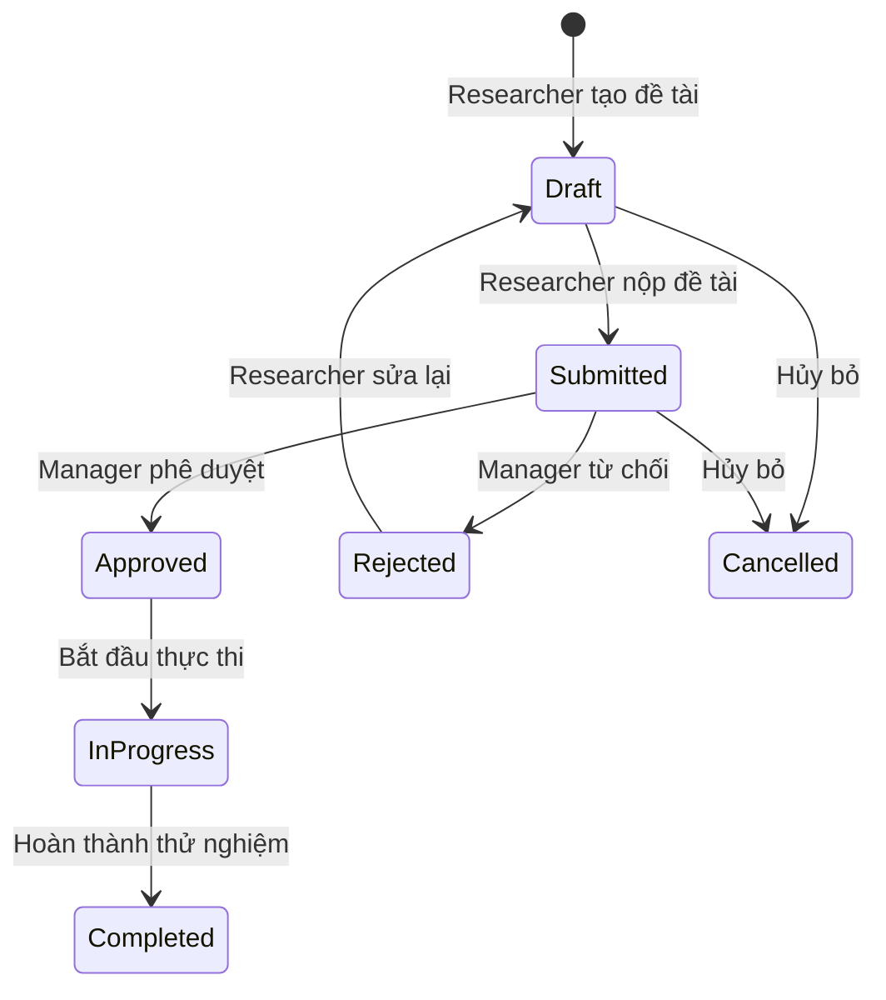

# FRP-AMSystem: Backend System Architecture & Technical Specification

> **Tài liệu tham chiếu toàn diện kiến trúc Backend (Backend Comprehensive Documentation)**  
> **Repository Path:** `c:\SAP\FRPAMSystem-BE`  
> **Mục đích:** Cung cấp bức tranh toàn cảnh, chi tiết về kiến trúc, cơ sở dữ liệu, các tầng nghiệp vụ (Business Tier), động cơ AI tối ưu hóa phân bổ tài nguyên (Genetic Algorithm Optimization), hệ thống sự kiện miền (Domain Events), SignalR Real-time Notifications, và toàn bộ danh mục API Endpoints.

---

## 1. Kiến trúc tổng quan (Architecture Overview)

Backend được xây dựng theo mô hình **Clean Architecture 3-Tier** trên nền tảng **.NET 8 (C#)**:



### Các Project chính trong Solution (`FRPAMSystem-BE.slnx`):
1. **`FRPAMSystem.API`**:
   - Chứa `Program.cs`, cấu hình Dependency Injection, Middleware, JWT Authentication, Swagger OpenAPI, Action Filter `AuditLogActionFilter`, và 30 RESTful Controllers.
   - Endpoint SignalR Hub tại `/hubs/notification`.
2. **`FRPAMSystem.BusinessTier`**:
   - Chứa toàn bộ Business Services, DTOs (Request / Response / Filters / Queryables), Domain Events & Event Handlers, Enums, Constants, Validators, và **AI Resource Allocation Optimization Subsystem** (Genetic Algorithm, Constraint Evaluators, Fitness Calculator).
3. **`FRPAMSystem.DataTier`**:
   - Chứa `ForestryResourcePlanningDbContext`, 27 Entities, Fluent API Configuration, Generic Repository (`IGenericRepository<T>`, `GenericRepository<T>`), `IUnitOfWork`, và thư viện phân trang (`IPaginate<T>`).
4. **`database`**:
   - Script SQL khởi tạo schema (`ForestryResourcePlanningDB.sql`), dữ liệu mẫu (`SeedData.sql`, `TestDataWithoutUsers.sql`).

---

## 2. Hệ thống vai trò & Phân quyền (Roles & Permissions)

Hệ thống quản lý 5 vai trò chính với ID tương ứng trong bảng `Role`:

| Role ID | Role Name | Mô tả nghiệp vụ | Quyền hạn chính |
| :--- | :--- | :--- | :--- |
| **1** | `Admin` | Quản trị viên hệ thống | Toàn quyền quản lý người dùng, vai trò, cấu hình hệ thống, xóa dữ liệu, audit log. |
| **2** | `Manager` | Quản lý tài nguyên rừng / Trưởng bộ phận | Phê duyệt/từ chối Thử nghiệm (Experiment), Phê duyệt/từ chối Kế hoạch phân bổ tài nguyên (Allocation Plan), quản lý toàn bộ kho thiết bị, quỹ đất. |
| **3** | `Researcher` | Nhà nghiên cứu / Chủ nhiệm đề tài | Tạo và quản lý Experiment, đề xuất nhu cầu tài nguyên (Equipment, Human, Land theo Phase), chạy AI tạo Allocation Plan, gán lịch làm việc (Schedule) cho nhân sự. |
| **4** | `Technician` | Kỹ thuật viên hiện trường | Xem lịch làm việc được phân công (`/Schedules/mine`), nhận thiết bị, cập nhật trạng thái tiến độ công việc (`InProgress`, `Completed`). |
| **5** | `Seasonal` *(hoặc Student)* | Nhân công thời vụ / Sinh viên thực tập | Xem lịch công việc cá nhân (`/Schedules/mine`), thực hiện các tác vụ điều tra, gieo trồng, lấy mẫu theo ca được Researcher phân công. |

---

## 3. Mô hình dữ liệu & Quan hệ thực thể (Database Schema & ER Model)

Hệ thống bao gồm 27 bảng dữ liệu, phân thành các nhóm nghiệp vụ rõ ràng:



### Chi tiết các nhóm bảng:

### 3.1. Người dùng & Nhân sự (Authentication & Human Resources)
- **`Role`**: `role_id` (PK), `role_name`, `description`.
- **`User`**: `user_id` (PK), `full_name`, `username`, `password_hash`, `email`, `role_id` (FK).
- **`HumanResourceProfile`**: `human_resource_id` (PK), `user_id` (FK Unique -> 1-1 với User), `max_working_hours_per_day`, `current_workload`, `status` (`Available`, `Busy`, `OnLeave`).
- **`Skill`**: `skill_id` (PK), `skill_name`, `category`, `description`.
- **`HumanResourceSkill`**: `hr_skill_id` (PK), `human_resource_id` (FK), `skill_id` (FK), `proficiency_level`, `years_of_experience`.

### 3.2. Đề tài thử nghiệm & Giai đoạn (Experiments & Phases)
- **`Experiment`**: `experiment_id` (PK), `researcher_id` (FK User), `experiment_name`, `description`, `objective`, `expect_start_date`, `expect_end_date`, `deadline`, `status` (`Draft`, `Submitted`, `Approved`, `Rejected`, `InProgress`, `Completed`, `Cancelled`), `priority` (0-4), `created_by`, `approve_by`, `approved_at`.
- **`ExperimentPhase`**: `experiment_phase_id` (PK), `experiment_id` (FK), `phase_name`, `phase_order`, `expected_start_date`, `expected_end_date`, `status` (`Planned`, `InProgress`, `Completed`).

### 3.3. Nhu cầu tài nguyên (Resource Requirements)
- **Cấp toàn bộ thử nghiệm (Experiment-level)**:
  - `ExperimentEquipmentRequirement`: `exp_equipment_req_id` (PK), `experiment_id`, `equipment_type_id`, `quantity`, `allow_substitute`, `min_acceptable_efficiency`.
  - `ExperimentHumanRequirement`: `exp_human_req_id` (PK), `experiment_id`, `role_id`, `required_skill_id`, `quantity`, `working_hours_per_day`.
  - `ExperimentLandRequirement`: `exp_land_req_id` (PK), `experiment_id`, `land_id`, `preferred_soil_type`, `min_area_size`.
- **Cấp từng giai đoạn (Phase-level)**:
  - `PhaseEquipmentRequirement`: `phase_equipment_req_id` (PK), `phase_id`, `equipment_type_id`, `quantity`, `allow_substitute`, `min_acceptable_efficiency`.
  - `PhaseHumanRequirement`: `phase_human_req_id` (PK), `phase_id`, `role_id`, `required_skill_id`, `quantity`, `working_hours_per_day`.

### 3.4. Kho tài nguyên vật lý & Quỹ đất (Inventory & Land Resources)
- **`EquipmentCategory`**: `equipment_category_id` (PK), `category_name`, `description`.
- **`EquipmentType`**: `equipment_type_id` (PK), `category_id` (FK), `type_name`, `standard_efficiency`, `requires_specialist`.
- **`EquipmentInstance`**: `equipment_instance_id` (PK), `equipment_type_id` (FK), `asset_code`, `status` (`Available`, `InUse`, `Maintenance`, `Broken`), `efficiency_rate`, `operating_hours`.
- **`EquipmentSubstitution`**: `substitution_id` (PK), `original_equipment_type_id` (FK), `substitute_equipment_type_id` (FK), `efficiency_ratio`, `is_bidirectional`.
- **`EquipmentShortageLog`**: `shortage_id` (PK), `allocation_plan_id` (FK), `equipment_type_id` (FK), `shortage_quantity`, `severity`.
- **`Area`**: `area_id` (PK), `area_name`, `location`, `description`.
- **`LandResource`**: `land_id` (PK), `area_id` (FK), `land_code`, `soil_type`, `area_size`, `status` (`Available`, `Allocated`, `Fallow`).

### 3.5. Kế hoạch phân bổ tài nguyên (Resource Allocation Plans)
- **`AllocationPlan`**: `allocation_plan_id` (PK), `experiment_id` (FK), `fitness_score` (AI Score), `constraint_report` (JSON kết quả xung đột), `approve_status` (`Draft`, `Pending`, `Approved`, `Rejected`, `Cancelled`), `created_by`, `approve_by`, `approved_at`.
- **`AllocationEquipmentDetail`**: `allocation_equipment_detail_id` (PK), `allocation_plan_id` (FK), `equipment_instance_id` (FK), `allocated_equipment_type_id` (FK), `is_substitute`, `efficiency_rate`, `start_date`, `end_date`, `status`.
- **`AllocationHumanDetail`**: `allocation_human_detail_id` (PK), `allocation_plan_id` (FK), `human_resource_id` (FK), `working_hours`, `start_date`, `end_date`, `status`.
- **`AllocationLandDetail`**: `allocation_land_detail_id` (PK), `allocation_plan_id` (FK), `land_id` (FK), `start_date`, `end_date`, `status`.

### 3.6. Lịch làm việc & Thực thi (Schedules & Execution)
- **`Schedule`**:
  - `schedule_id` (PK)
  - `allocation_plan_id` (FK -> `AllocationPlan`)
  - `phase_id` (FK Nullable -> `ExperimentPhase`)
  - `title` (Tên đầu việc)
  - `description` (Mô tả chi tiết công việc)
  - `start_date`, `end_date` (Khoảng thời gian thực hiện)
  - `status` (`Planned`, `InProgress`, `Completed`, `Cancelled`)
  - `created_by` (FK Nullable -> `User`)
  - `assigned_human_resource_id` (FK Nullable -> `HumanResourceProfile`)
  - `notes` (Ghi chú an toàn / thiết bị)
  - `priority` (0: Low, 1: Medium, 2: High, 3: Urgent)
  - `created_at`, `updated_at`

### 3.7. Thông báo & Nhật ký hệ thống (Notifications & Audit Logs)
- **`Notification`**: `notification_id` (PK), `user_id` (FK người nhận), `title`, `message`, `notification_type` (`ExperimentCreated`, `AllocationPlanSubmitted`, `ScheduleAssigned`,...), `reference_type` (`Experiment`, `AllocationPlan`, `Schedule`), `reference_id`, `is_read`, `created_at`.
- **`AuditLog`**: `audit_log_id` (PK), `user_id` (FK), `action_type`, `entity_name`, `entity_id`, `ip_address`, `timestamp`, `details`.

---

## 4. Động cơ AI tối ưu hóa phân bổ (AI Genetic Algorithm Engine)

Phân hệ AI nằm trong `FRPAMSystem.BusinessTier/AI`:

### 4.1. Cấu trúc nhiễm sắc thể (Chromosome Structure)
- **`AllocationPlanChromosome`**:
  - `LandGenes`: Phân bổ thửa đất cho đề tài.
  - `EquipmentGenes`: Danh sách gán các `EquipmentInstance` cụ thể cho từng nhu cầu (hỗ trợ tự động thay thế bằng `EquipmentSubstitution` nếu thiết bị chính thiếu).
  - `HumanGenes`: Danh sách gán các `HumanResourceProfile` (Technician/Seasonal) phù hợp với kỹ năng yêu cầu (`Skill`) và giới hạn thời gian làm việc (`MaxWorkingHoursPerDay`).

### 4.2. Bộ đánh giá ràng buộc (Constraint Evaluators)
- **`LandConstraintEvaluator`**: Kiểm tra trùng lặp lịch sử dụng đất giữa các đề tài khác nhau trong cùng khung thời gian.
- **`HumanConstraintEvaluator`**: Đảm bảo không quá tải giờ làm việc (`CurrentWorkload + NewHours <= MaxWorkingHoursPerDay`), trùng lịch, và đúng kỹ năng.
- **`EquipmentConstraintEvaluator`**: Kiểm tra tính sẵn sàng của cá thể thiết bị, tránh trùng lịch gán máy, tính tỷ lệ giảm hiệu suất nếu dùng thiết bị thay thế.
- **`MaintenanceConstraintEvaluator`**: Ngăn việc gán thiết bị đang trong chu kỳ bảo dưỡng.
- **`ScheduleConstraintEvaluator`**: Đảm bảo thứ tự thực hiện các Phase tuần tự, không bị giao chéo thời gian vô lý.

### 4.3. Thuật toán tiến hóa (Genetic Algorithm Process)
1. **Khởi tạo quần thể (`PopulationGenerator`)**: Sinh ngẫu nhiên $N$ phương án phân bổ hợp lệ ban đầu.
2. **Hàm thích nghi (`FitnessCalculator`)**:
   $$\text{Fitness} = 100 - \sum (\text{Penalty}_{\text{Conflict}} \times W_1) - \sum (\text{Penalty}_{\text{SubEfficiency}} \times W_2) - \sum (\text{Penalty}_{\text{Overload}} \times W_3)$$
3. **Chọn lọc (`TournamentSelectionOperator`)**: Chọn lọc các cá thể có điểm thích nghi cao nhất.
4. **Lai ghép (`SinglePointCrossoverOperator`)**: Ghép cặp các phương án để tạo ra thế hệ kế thừa tốt hơn.
5. **Đột biến thích ứng (`AdaptiveMutationOperator`)**: Thay đổi ngẫu nhiên gán thiết bị / nhân sự để thoát khỏi cực tiểu cục bộ.
6. **Kết quả**: Sinh ra `AllocationPlan` tối ưu nhất với `FitnessScore` và báo cáo xung đột `ConstraintReport`.

---

## 5. Hệ thống Domain Events & SignalR Real-time Notifications

Hệ thống xử lý sự kiện bất đồng bộ theo mô hình Domain-Driven:



### Danh sách Domain Events đã triển khai:
1. `ExperimentCreatedEvent` -> Báo cho Manager có đề tài mới.
2. `ExperimentSubmittedEvent` -> Báo Manager duyệt đề tài.
3. `ExperimentApprovedEvent` / `ExperimentRejectedEvent` -> Báo cho Researcher kết quả duyệt đề tài.
4. `AllocationPlanGeneratedEvent` -> Thông báo khi AI sinh xong phương án phân bổ.
5. `AllocationPlanSubmittedEvent` -> Báo Manager duyệt phương án tài nguyên.
6. `AllocationPlanApprovedEvent` / `AllocationPlanRejectedEvent` -> Báo cho Researcher biết kế hoạch tài nguyên đã duyệt/từ chối.
7. `AllocationPlanShortageDetectedEvent` -> Báo cảnh báo thiếu hụt thiết bị cho Manager.
8. `ConflictDetectedEvent` -> Cảnh báo trùng lịch hoặc quá tải tài nguyên.
9. `ScheduleAssignedEvent` -> Báo trực tiếp cho Technician / Seasonal khi được gán lịch làm việc mới.

---

## 6. Danh mục API Endpoints toàn diện (API Catalog)

Toàn bộ 30 Controllers được định tuyến tại tiền tố `api/[controller]`:

### 6.1. Xác thực & Người dùng (`/api/Auth`, `/api/Users`, `/api/Roles`)
- `POST /api/Auth/login`: Đăng nhập (Username, Password) -> trả về JWT Token, Role, UserInfo.
- `GET /api/Users`: Danh sách người dùng (Admin, Manager).
- `GET /api/Users/me`: Thông tin người dùng hiện tại đang đăng nhập.
- `GET /api/Users/{id}`: Chi tiết người dùng theo ID.
- `POST /api/Users`: Tạo tài khoản người dùng mới (Admin).
- `PUT /api/Users/{id}`: Cập nhật người dùng (Admin).
- `DELETE /api/Users/{id}`: Xóa người dùng (Admin).
- `GET /api/Roles`: Danh sách các vai trò trong hệ thống.

### 6.2. Thử nghiệm (`/api/Experiments`, `/api/ExperimentPhases`)
- `GET /api/Experiments`: Lọc và phân trang danh sách thử nghiệm (`Status`, `ResearcherId`, `Keyword`,...).
- `GET /api/Experiments/mine`: Danh sách thử nghiệm của Researcher hiện tại.
- `GET /api/Experiments/{id}`: Chi tiết thử nghiệm và trạng thái phê duyệt.
- `POST /api/Experiments`: Tạo đề tài thử nghiệm mới (Researcher).
- `PUT /api/Experiments/{id}`: Chỉnh sửa thông tin đề tài (Researcher).
- `DELETE /api/Experiments/{id}`: Xóa đề tài (Admin, Manager).
- `POST /api/Experiments/{id}/submit`: Nộp đề tài lên Manager phê duyệt (Researcher).
- `POST /api/Experiments/{id}/approve`: Phê duyệt đề tài (Manager).
- `POST /api/Experiments/{id}/reject`: Từ chối đề tài kèm lý do (Manager).
- `POST /api/Experiments/{id}/cancel`: Hủy đề tài.
- `GET /api/ExperimentPhases`: Lấy danh sách các giai đoạn (`ExperimentId`).
- `POST /api/ExperimentPhases`: Thêm giai đoạn mới cho thử nghiệm.
- `PUT /api/ExperimentPhases/{id}`: Cập nhật giai đoạn.
- `DELETE /api/ExperimentPhases/{id}`: Xóa giai đoạn.

### 6.3. Nhu cầu tài nguyên (`/api/ExperimentEquipmentRequirements`, `/api/ExperimentHumanRequirements`, `/api/ExperimentLandRequirements`, `/api/PhaseEquipmentRequirements`, `/api/PhaseHumanRequirements`)
- CRUD toàn bộ các nhu cầu thiết bị, nhân sự, quỹ đất ở cấp độ Toàn thử nghiệm (Experiment-level) hoặc Từng giai đoạn (Phase-level).

### 6.4. Kho tài nguyên & Kỹ năng (`/api/EquipmentCategories`, `/api/EquipmentTypes`, `/api/EquipmentInstances`, `/api/EquipmentSubstitutions`, `/api/EquipmentShortageLogs`, `/api/LandResources`, `/api/Areas`, `/api/Skills`, `/api/HumanResourceProfiles`, `/api/HumanResourceSkills`)
- Quản lý phân loại thiết bị, cá thể máy móc (`asset_code`, `operating_hours`, `efficiency_rate`).
- Quản lý quy tắc thay thế thiết bị tương đương (`EquipmentSubstitutions`).
- Quản lý quỹ đất thử nghiệm, thổ nhưỡng (`soil_type`), diện tích (`area_size`).
- Quản lý hồ sơ nhân sự (`HumanResourceProfiles`), kỹ năng chuyên môn (`HumanResourceSkills`).

### 6.5. Phân bổ tài nguyên (`/api/AllocationPlans`, `/api/AllocationEquipmentDetails`, `/api/AllocationHumanDetails`, `/api/AllocationLandDetails`, `/api/AllocationOptimizations`)
- `GET /api/AllocationPlans`: Danh sách kế hoạch phân bổ.
- `GET /api/AllocationPlans/{id}`: Chi tiết kế hoạch phân bổ (kèm điểm fitness và lịch sử duyệt).
- `POST /api/AllocationPlans`: Tạo kế hoạch phân bổ thủ công.
- `POST /api/AllocationPlans/{id}/submit`: Nộp kế hoạch phân bổ cho Manager duyệt.
- `POST /api/AllocationPlans/{id}/approve`: Manager phê duyệt kế hoạch phân bổ.
- `POST /api/AllocationPlans/{id}/reject`: Manager từ chối kế hoạch phân bổ.
- `POST /api/AllocationPlans/{id}/evaluate`: Đánh giá lại điểm thích nghi (Fitness Score) của kế hoạch.
- `POST /api/AllocationOptimizations/generate`: **Chạy thuật toán AI Genetic Algorithm** tự động tạo kế hoạch phân bổ tối ưu cho một Experiment.
- `GET /api/AllocationEquipmentDetails`: Danh sách chi tiết gán thiết bị theo `allocationPlanId`.
- `GET /api/AllocationHumanDetails`: Danh sách chi tiết gán nhân sự theo `allocationPlanId`.
- `GET /api/AllocationHumanDetails/mine`: Nhân sự xem phân bổ của chính mình.
- `GET /api/AllocationLandDetails`: Danh sách chi tiết gán thửa đất theo `allocationPlanId`.

### 6.6. Lịch làm việc (`/api/Schedules`)
- `GET /api/Schedules`: Xem danh sách lịch làm việc toàn hệ thống (hỗ trợ lọc theo `AllocationPlanId`, `PhaseId`, `AssignedHumanResourceId`, `AssignedUserId`, `Status`, `DateFrom`, `DateTo`).
- `GET /api/Schedules/mine`: **Xem lịch làm việc cá nhân của người dùng đăng nhập** (Dành cho Technician, Seasonal, Researcher).
- `GET /api/Schedules/mine/{id}`: Xem chi tiết 1 lịch làm việc cá nhân.
- `GET /api/Schedules/{id}`: Xem chi tiết lịch làm việc theo ID.
- `POST /api/Schedules`: Tạo lịch làm việc mới và gán cho nhân sự (Researcher, Manager, Admin).
- `PUT /api/Schedules/{id}`: Chỉnh sửa lịch làm việc.
- `PATCH /api/Schedules/{id}/status`: Cập nhật trạng thái tiến độ (`Planned`, `InProgress`, `Completed`) và ghi chú.
- `DELETE /api/Schedules/{id}`: Xóa lịch làm việc (Admin, Manager).

### 6.7. Thông báo & Audit Log (`/api/Notifications`, `/api/AuditLogs`)
- `GET /api/Notifications/mine`: Danh sách thông báo của người dùng đăng nhập.
- `GET /api/Notifications/mine/unread-count`: Đếm số thông báo chưa đọc.
- `PATCH /api/Notifications/{id}/read`: Đánh dấu thông báo đã đọc.
- `POST /api/Notifications/read-all`: Đánh dấu toàn bộ thông báo đã đọc.
- `GET /api/AuditLogs`: Xem nhật ký thao tác người dùng (Admin).

---

## 7. Các luồng nghiệp vụ cốt lõi (Core Business Workflows)

### 7.1. Luồng đề tài thử nghiệm & Phê duyệt (Experiment Lifecycle)


### 7.2. Luồng phân bổ tài nguyên & Gán lịch công việc (Allocation to Schedule Assignment)
1. **Researcher tạo Experiment** và khai báo đầy đủ các **Phase**, nhu cầu thiết bị, nhân sự, thửa đất.
2. **Chạy AI Tối ưu hóa**: Researcher kích hoạt `POST /api/AllocationOptimizations/generate`. AI Genetic Algorithm tự động tìm kiếm phương án không xung đột, thay thế thiết bị hợp lý, tính điểm `fitnessScore` và sinh `AllocationPlan`.
3. **Phê duyệt phân bổ**: Researcher nộp kế hoạch (`/submit`), Manager kiểm tra và bấm Phê duyệt (`/approve`).
4. **Gán lịch làm việc cho Seasonal / Technician**:
   - Sau khi `AllocationPlan` có trạng thái **`Approved`**, Researcher truy cập trang chi tiết.
   - Researcher bấm **"Assign Work Schedule"** hoặc bấm nút gán trực tiếp trên từng nhân sự Seasonal / Technician thuộc Allocation Plan.
   - Hệ thống tạo `Schedule` gán với `AssignedHumanResourceId` / `AssignedUserId`, kích hoạt `ScheduleAssignedEvent`.
   - Backend tự động gửi thông báo Real-time (SignalR) và lưu Notification cho tài khoản Seasonal / Technician.
5. **Thực thi hiện trường**:
   - Nhân viên Technician / Seasonal đăng nhập, xem danh sách công việc cá nhân tại `/schedules/mine` hoặc Lịch tuần/tháng `/schedules/calendar`.
   - Cập nhật tiến độ: Bắt đầu làm -> chuyển `InProgress`, hoàn thành -> chuyển `Completed`.

---

## 8. Quy chuẩn dữ liệu & Kết nối Frontend - Backend (Contract Standards)

1. **Chuẩn hóa phản hồi API (API Response Envelope)**:
   ```json
   {
     "success": true,
     "message": "Operation description",
     "data": { ... }
   }
   ```
2. **Phân trang (Paginate Model)**:
   ```json
   {
     "page": 1,
     "size": 20,
     "total": 100,
     "totalPages": 5,
     "items": [ ... ]
   }
   ```
3. **Định dạng thời gian**: Tất cả `DateTime` trao đổi qua API đều theo định dạng chuẩn **ISO 8601 UTC** (`YYYY-MM-DDTHH:mm:ssZ`).
4. **Quan hệ User và HumanResourceProfile**:
   - Mọi `HumanResourceProfile` đều tham chiếu tới một `User.UserId` duy nhất.
   - Khi gán lịch theo `UserId`, Backend tra cứu `HumanResourceProfile.UserId` để lấy `HumanResourceId` tương ứng, đảm bảo tính toàn vẹn khóa ngoại.
